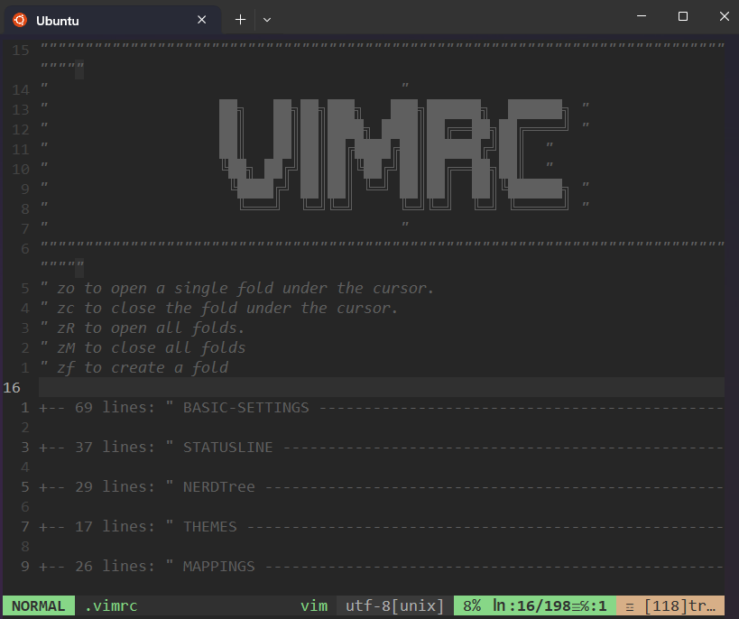

<div align="center">



---
Configured with 💗 by: [mflores-](https://github.com/mariav7)

</div>

## Dotfiles

These are my configuration files for various tools, including: [Vim](https://www.vim.org/), [Zsh](https://ohmyz.sh/), [Git](https://git-scm.com/) and more.
Feel free to explore, use, and adapt these configurations to suit your sauce :stew:

I've crafted these dotfiles by drawing inspiration from other talented individuals in the open-source community.
Exploring and learning from their configurations has been instrumental in shaping my own setup.
Now, I'm sharing my dotfiles with the hope that they might be useful or inspiring to others.

---

## Configuration

1. **`.vimrc`** file
   * Shortcut keys for folds in .vimrc:
     * `zo` to open a single fold under the cursor
     * `zc` to close the fold under the cursor
     * `zR` to open all folds
     * `zM` to close all folds
     * `zf` to create a fold
   * File system explorer: [NERDTree](https://github.com/preservim/nerdtree)
   * Vim theme: [Onedark](https://github.com/joshdick/onedark.vim)
   * Statusline theme: [Lightline](https://github.com/itchyny/lightline.vim)
   * Plugins: [42Header](https://github.com/42Paris/42header)
2. **`.zshrc`** file
   * Zsh theme: [Dracula](https://draculatheme.com/zsh)

---

## Installation

**Clone repository:**
```bash
git clone git@github.com:mariav7/dotfiles.git
cd dotfiles
```

> [!WARNING]  
> DO NOT run this script unless you UNDERSTAND what it does

**First time setup (install: zsh, vim, git, make, etc ...):**
```bash
chmod +xr setup.sh && ./setup.sh
```

---
